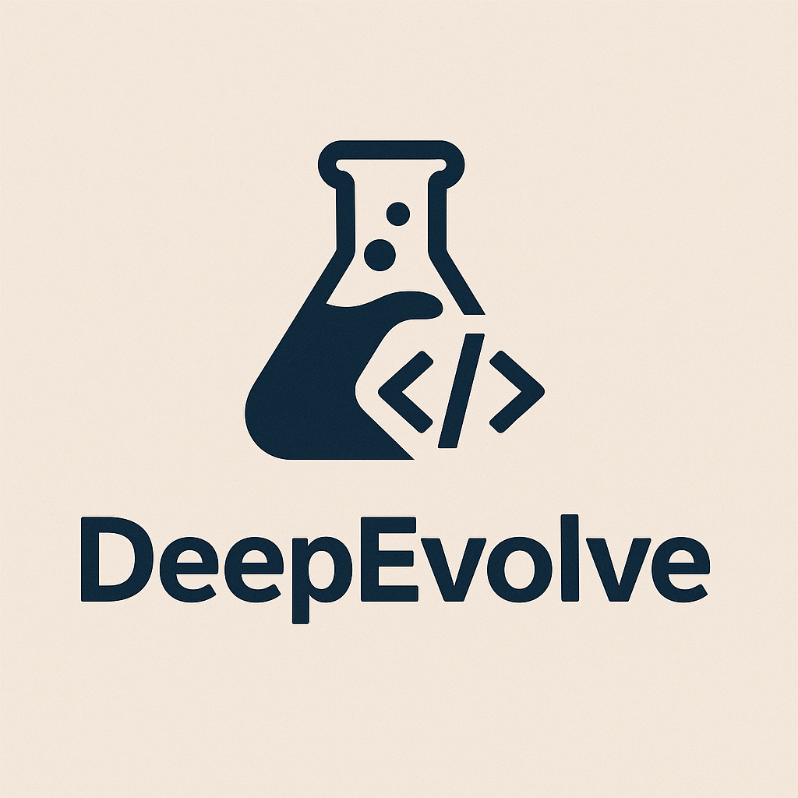
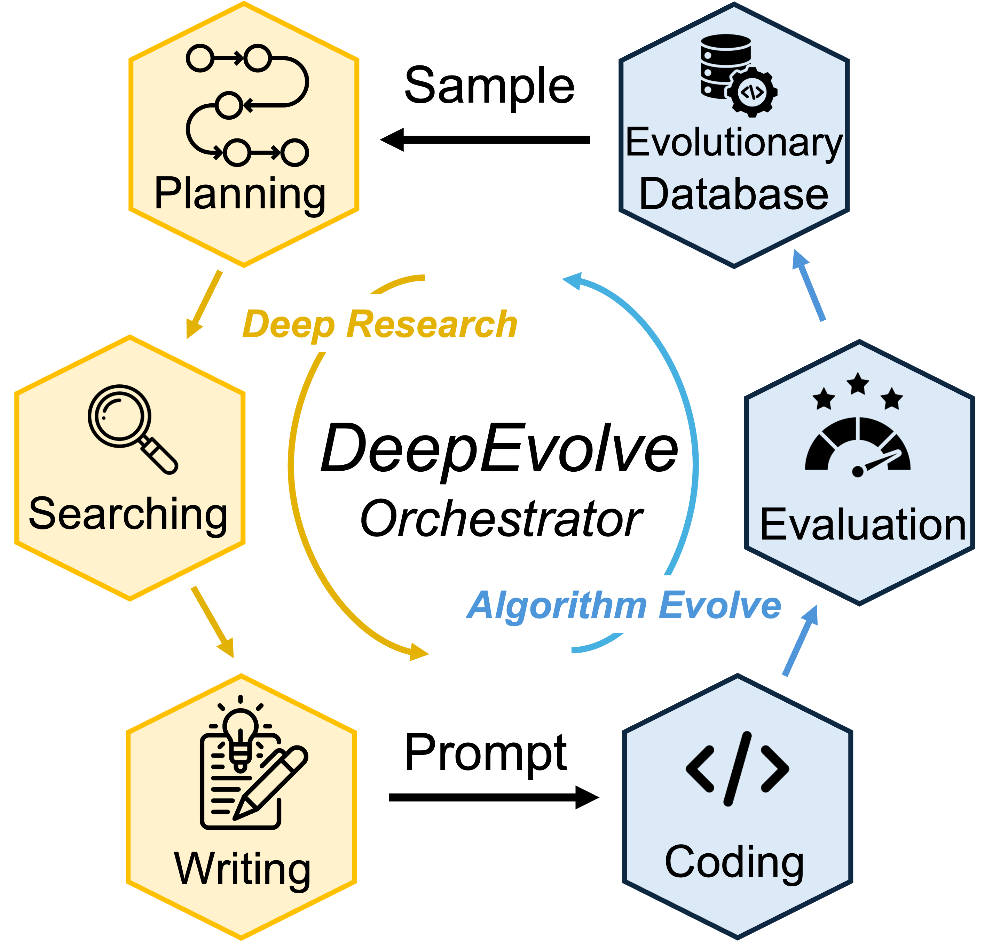

<div style="display: flex; align-items: center; gap: 20px;">
  
  <div>
    <h1>DeepEvolve: Discovering New Scientific Algorithms with Deep Research and AlphaEvolve</h1>
  </div>
</div>

## Overview
**DeepEvolve** is a coding agent for new algorithm discovery in different science domains. It combines two parts:

1. **Deep Research** – plans fresh ideas, searches the internet, and writes a research draft.  
2. **AlphaEvolve** – implements the idea, evaluates it, and improves the algorithm through iterative code evolution.

<p align="center">
  
</p>

## Comparison: DeepEvolve vs AlphaEvolve

| Feature | AlphaEvolve | DeepEvolve |
|---------|-------------|------------|
| **Knowledge Base** | Based on LLMs' internal knowledge | **Broader knowledge**: searches information from the Internet |
| **Code Evolution Scope** | Evolves up to hundreds of lines of code | **Multi-file evolution**: handles whole codebases, not just single files |
| **Debugging Support** | No debugging | **Automatic debugging**: runs and fixes code during each iteration |
| **Domain Application** | Preliminarily applied to math | **Wider domain support**: works for math, chemistry, biology, materials, and more |

DeepEvolve also shares many benefits with AlphaEvolve such as: benefits from SOTA LLMs, the ability to evaluate performance for extended periods with GPU acceleration with rich context and feedback in prompts, and the capability to simultaneously optimize multiple metrics.

---

## Installation

### Create an environment
```bash
conda create --name deepevolve python=3.9.21
conda activate deepevolve
```
### Install dependencies

Choose one of the following options:

**Option 1: Full installation** (recommended for running projects in the `examples` folder)
```bash
pip install -r requirements.txt
```

**Option 2: Minimal installation** (for custom projects and the circle packing examples)
```bash
pip install -r requirements-mini.txt
```

For the minimal installation, you'll need to add any additional packages required by your specific project.

---

## Usage

Run DeepEvolve on the circle-packing example:

```bash
python deepevolve.py \
    query="'You are an expert mathematician. Your task is to improve an algorithm that maximizes the sum of circle radii in the circle-packing problem within a unit square, using between 26 and 32 circles. Do not develop neural-network-based models. The algorithm must produce exact, valid packings that satisfy these constraints: circles not overlap and must remain entirely within the square.'" \
    problem="circle_packing"
```

* `query`: user instructions.
* `problem`: folder name in the `examples` directory
* More parameters can be found in `configs/config`. Common settings include `workspace` (defaults to `"examples"`), `checkpoint` (defaults to `"ckpt"`)

DeepEvolve is built on the [OpenAI Agents SDK](https://github.com/openai/openai-agents-python).
Set `OPENAI_API_KEY` in your environment. To run other models, see the [LiteLLM example](https://github.com/openai/openai-agents-python/blob/main/examples/model_providers/litellm_auto.py).

Results are written to
`{workspace}/{problem}/{checkpoint}/best` (best run) and periodic checkpoints in the same `{workspace}/{problem}/{checkpoint}/checkpoint_{i}` (frequency set by `checkpoint_interval`).
Example outputs are included under `examples/circle_packing/ckpt`.

---

## Adding a New Problem

1. Inside the workspace (default: `examples`), create a folder named after the problem.

2. Place your starter code in an `initial_code` subfolder.

3. Add an `info.json` file:

   ```json
   {
     "problem": {
       "name": "problem name",
       "description": "description of the problem",
       "metric": "description of the metric",
       "interface": "deepevolve_interface.py"
     },
     "initial_idea": {
       "title": "initial idea title",
       "content": "description or link to the idea",
       "supplement": "description or link to extra material"
     }
   }
   ```

4. In `initial_code`, write `deepevolve_interface.py` that defines:

   ```python
   def deepevolve_interface() -> tuple[bool, dict | str]:
       """
       Returns:
           success (bool): True if run finished without error.
           result: metric dict (must include "combined_score") or error text.
       """
   ```

   The metric dictionary guides optimization; a higher `combined_score` is better.
   You can include other metrics (floats or strings), which will also be used to instruct the LLMs.
   A simple example for `deepevolve_interface.py` is:

   ```python
   import traceback
   from time import time
   import warnings

   # import the main function in the initial code
   # from main_file import main_func

   def deepevolve_interface():
       try:
           with warnings.catch_warnings(record=True) as caught:
               warnings.simplefilter("always")
               start_time = time()
               eval_score = main_func(args)
               runtime = time() - start_time

           warning_messages = [str(w.message) for w in caught]

           runtime = round(runtime / 60, 2)
           metrics = {
               "combined_score": eval_score,
               "runtime_minutes": runtime,
           }

           if warning_messages:
               warning_messages = list(set(warning_messages))
               if len(warning_messages) > 10:
                   warning_messages = warning_messages[:10]
               metrics["program_warnings"] = warning_messages
           return True, metrics
           
       except Exception as e:
           # Capture full traceback information
           error_traceback = traceback.format_exc()
           error_info = f"""
           Error type: {type(e).__name__}
           Error message: {str(e)}
           Traceback: {error_traceback}
           """
           return False, error_info
   ```
   You are welcome to check the examples for different definitions of the interface file and the `deepevolve_interface()` function.

**(Optional) Dataset Preparation:** Many scientific projects require training and evaluating deep learning models on different datasets. We save these datasets in the `data_cache` folder. If you are running one of the provided example projects, you can prepare the dataset by running the corresponding Python script in the `data_cache` folder. For example, you can `cd data_cache` and then run `python {problem_name}.py`.

---

## More Examples and Discoveries

We provide examples across different domains.

| Example            | Task                                       | Category  | Source                                                                                                  |
| ------------------ | ------------------------------------------ | --------- | ------------------------------------------------------------------------------------------------------- |
| molecule           | Molecular Property Prediction              | Chemistry | [OGB](https://ogb.stanford.edu/)                                                      |
| parkinson\_disease | Parkinson's Disease Progression Prediction | Biology   | [Kaggle competition](https://www.kaggle.com/competitions/amp-parkinsons-disease-progression-prediction) |
| circle\_packing    | Circle Packing                             | Math      | [AlphaEvolve](https://arxiv.org/pdf/2506.13131) / [Erich's Packing Center](https://erich-friedman.github.io/packing/cirinsqu/)              |
| usp\_p2p           | U.S. Patent Phrase-to-Phrase Matching      | Patent    | [Kaggle competition](https://www.kaggle.com/competitions/us-patent-phrase-to-phrase-matching)           |
| polymer            | Polymer Property Prediction                | Materials | [Kaggle competition](https://www.kaggle.com/competitions/neurips-open-polymer-prediction-2025/)         |
| nuclei\_image      | Nuclei Image Segmentation                  | Biology   | [Kaggle competition](https://www.kaggle.com/competitions/data-science-bowl-2018/data)                   |


We display the discovered algorithms in the `discoveries` directory.

---

## Acknowledgements

DeepEvolve builds on several open-source projects, and we appreciate their contributions.

* [OpenEvolve](https://github.com/codelion/openevolve)
* [OpenAI Agent examples](https://github.com/openai/openai-agents-python/tree/main/examples/research_bot)
* [Gemini LangGraph quick-start](https://github.com/google-gemini/gemini-fullstack-langgraph-quickstart)

---

## Citations

```
@software{deepevolve,
  title = {DeepEvolve: Discovering New Scientific Algorithms with Deep Research and AlphaEvolve},
  author = {Gang Liu},
  year = {2025},
  publisher = {GitHub},
  url = {https://github.com/liugangcode/deepevolve}
}
```